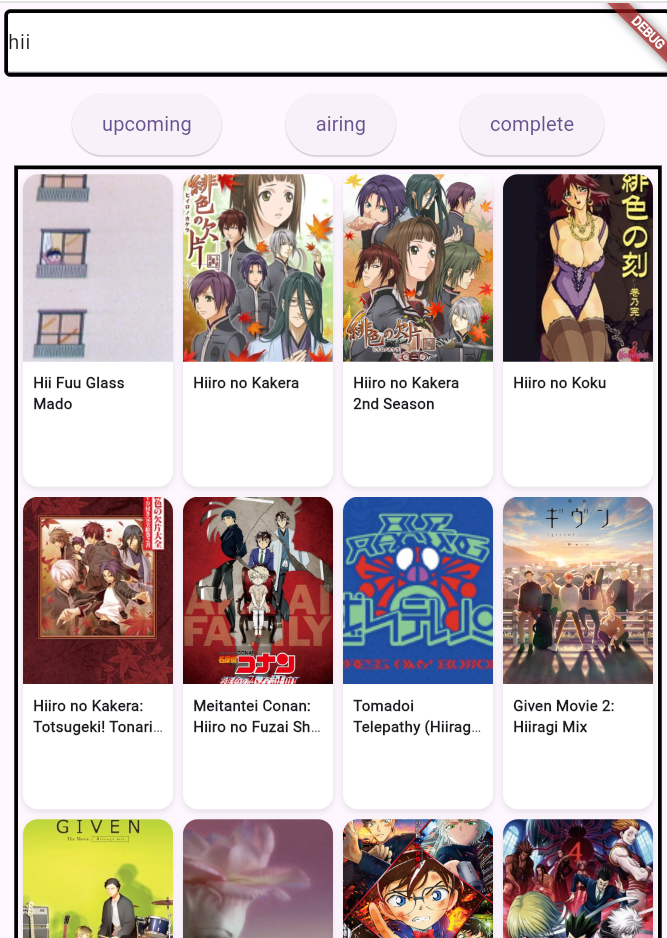
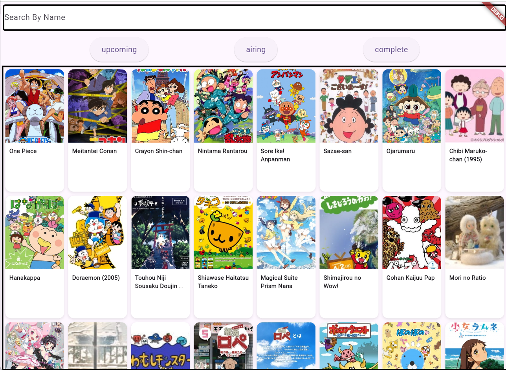
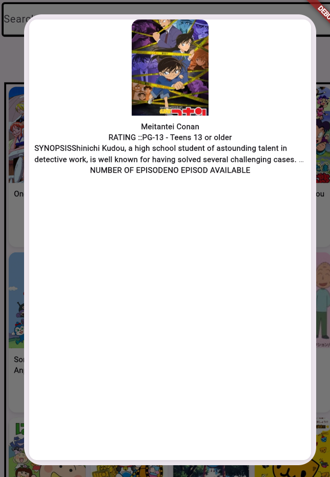

# meetmux_app

A new IOS APP.

## Getting Started

This project is a assiament of meetmux

A modern, interactive Flutter application for discovering and exploring anime content using the Jikan API. Discover your next favorite anime with beautiful interfaces and powerful search capabilities.

Description:
The goal is to develop a live iOS app that enables users to search, view, and interact with
anime-related content fetched from the Jikan API. The app should emphasize clean UI/UX,
real-time updates, and smooth navigation across different views.
Users should be able to:

1. Search for anime titles using keywords.
2. View detailed information about selected anime — including title, synopsis, rating,
   episodes, and genres.
3. Explore popular, upcoming, and top-rated anime lists through categorized tabs or
   sections.
4. Add anime to a “Favorites” or “Watchlist” section, stored locally on the device.
5. (Bonus) Display character details or related anime using additional endpoints from the
   API.

## Ouptput

